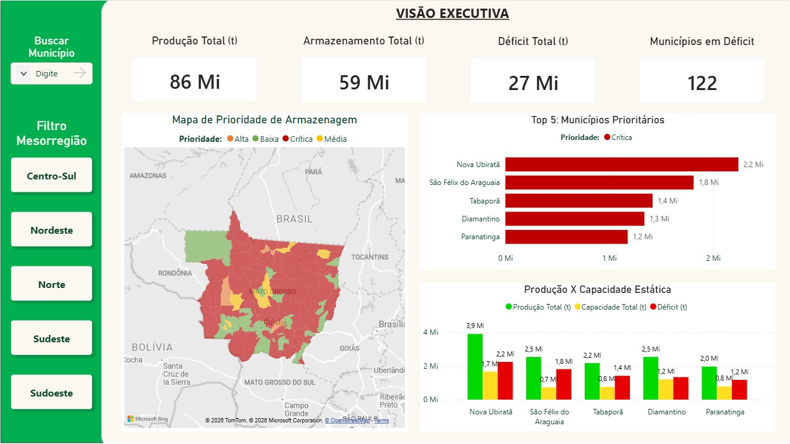
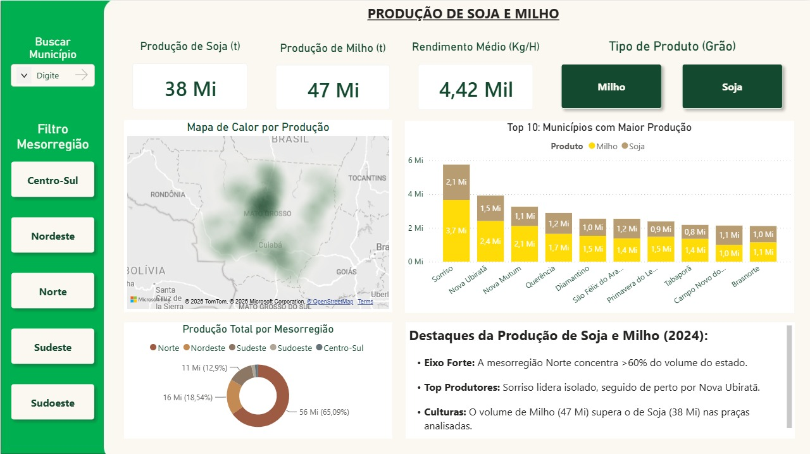
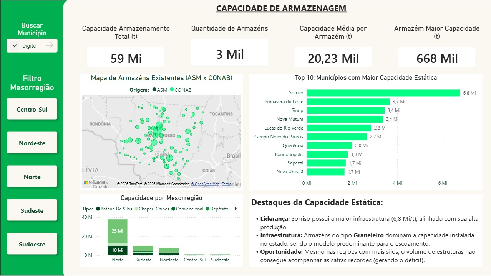
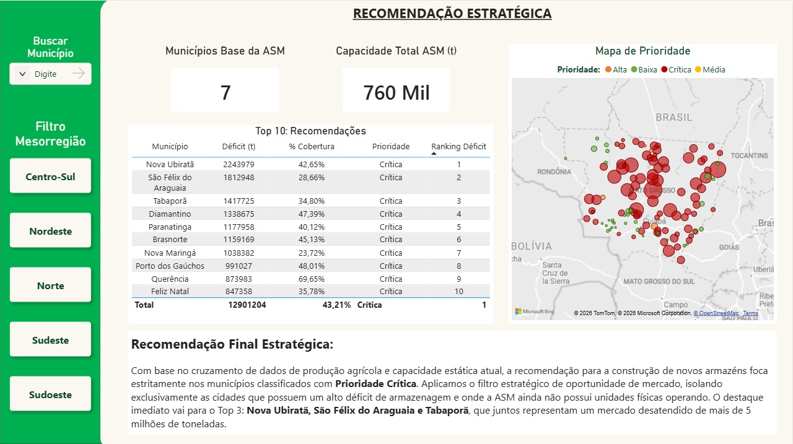
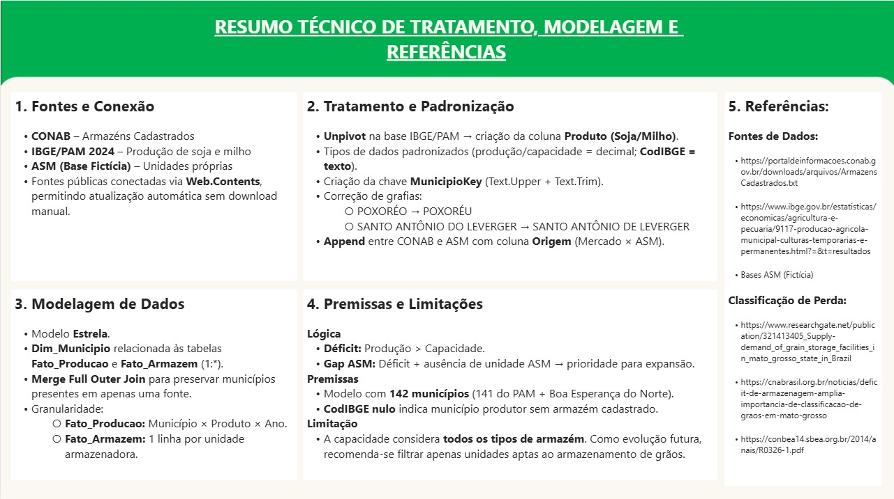
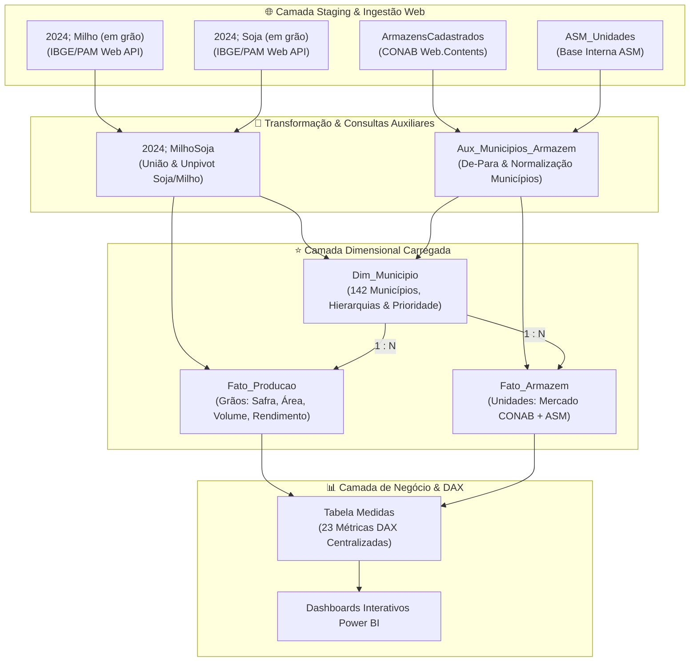
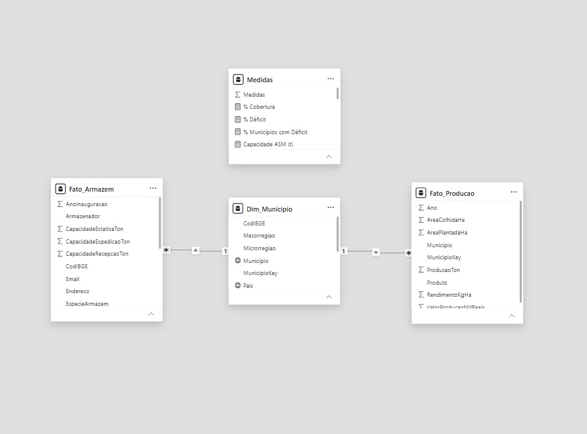
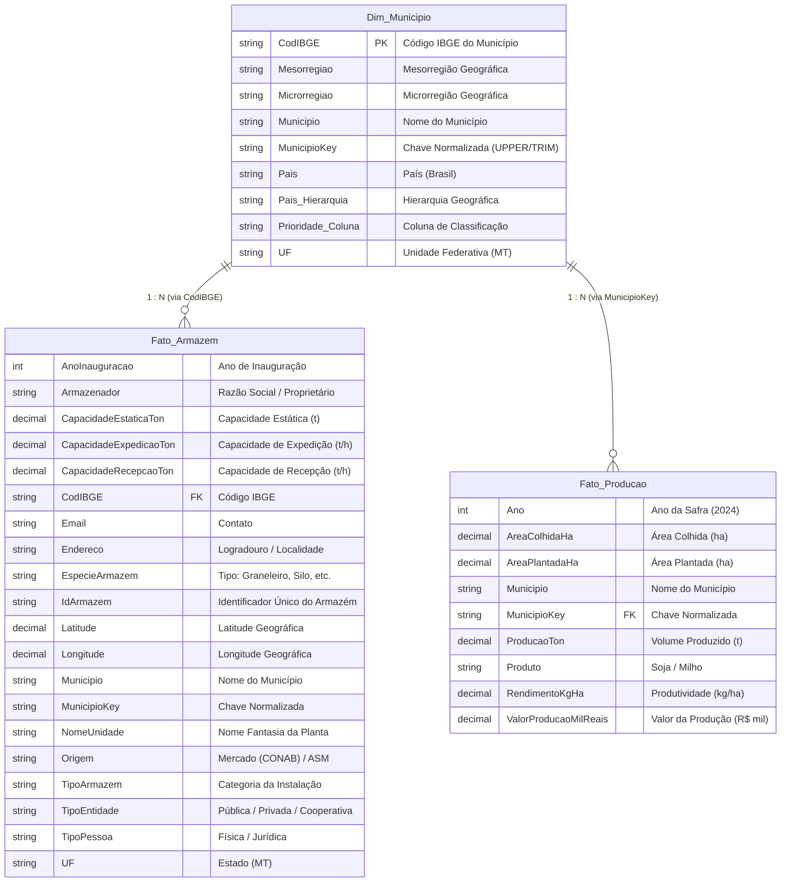

# 🌾 Expansão Estratégica de Armazenagem de Grãos no Mato Grosso
### Business Intelligence & Decision Support | Case ASM (Fictício)


---

## 📌 1. Contexto do Projeto & Desafio de Negócio

O estado do **Mato Grosso** é o motor do agronegócio brasileiro, consolidando safras recordes de soja e milho ano após ano. Contudo, a velocidade do crescimento da produção agrícola supera com folga a expansão da infraestrutura logística e de armazenagem, gerando um **déficit estrutural histórico de capacidade estática**.

A **ASM**, empresa com atuação no setor de armazenagem de grãos, planeja construir novas unidades operacionais no estado para suprir essa demanda crescente.

> *"Em quais municípios do Mato Grosso a ASM deve priorizar a construção de novas unidades de armazenagem de grãos para maximizar seu retorno sobre capital e preencher as maiores lacunas de mercado?"*

Este repositório contém a solução completa de **Business Intelligence (Power BI)** desenvolvida para suportar essa tomada de decisão executiva, desde o pipeline automatizado de ingestão de dados públicos (CONAB e IBGE) e modelagem dimensional em esquema estrela, até dashboards visuais e recomendações estratégicas.

---

## 🎯 2. Resposta às Perguntas Centrais do Case

| Pergunta de Negócio | Resposta Estratégica & Insight | Visualização no Painel |
| :--- | :--- | :--- |
| **1. Qual a capacidade estática instalada no MT por município?** | O estado conta com **59 Milhões de toneladas** distribuídas em cerca de **3 mil armazéns** (capacidade média de 20,23 mil t). **Sorriso** lidera com 6,8 Mi t, seguido por Primavera do Leste (3,7 Mi t) e Sinop (3,4 Mi t). Os armazéns do tipo *Graneleiro* dominam amplamente o escoamento. | `Capacidade de Armazenagem` |
| **2. Qual a produção de soja e milho por município?** | A produção total analisada atingiu **86 Milhões de toneladas** (Milho: **47 Mi t**, Soja: **38 Mi t**), com rendimento médio de **4,42 mil kg/ha**. A **Mesorregião Norte** concentra mais de **65% da safra estadual (56 Mi t)**, tendo Sorriso (5,8 Mi t) e Nova Ubiratã (3,9 Mi t) como polos líderes. | `Produção de Soja e Milho` |
| **3. Qual a relação entre produção e capacidade (Déficit)?** | O déficit estadual de armazenagem é crítico: **27 Milhões de toneladas**. Dos 142 municípios produtores mapeados, **122 municípios (85,9%) operam em déficit**, onde a colheita excede a capacidade estática local, forçando o escoamento sob pressão de frete e risco de perda. | `Visão Executiva` |
| **4. Quais municípios priorizar para novas unidades da ASM?** | Cruzando o déficit crítico com a ausência de unidades operacionais da ASM (*Gap de Mercado*), o **Top 3 de expansão imediata** é composto por: **1º Nova Ubiratã** (déficit de 2,24 Mi t), **2º São Félix do Araguaia** (1,81 Mi t) e **3º Tabaporã** (1,42 Mi t). Juntos, representam **mais de 5,4 milhões de toneladas desatendidas**. | `Recomendação Estratégica` |

---

## 🖥️ 3. Visão Geral das Telas do Dashboard

O dashboard foi estruturado em **5 páginas complementares**, desenhadas sob princípios de storytelling executivo, paleta harmoniosa e navegação intuitiva:

### 1️⃣ Visão Executiva (Macro Dashboard)
Painel de controle consolidado para a alta diretoria, destacando os números globais do estado (Produção, Armazenamento, Déficit e Municípios Afetados), mapa coroplético de prioridades e o Top 5 de municípios críticos.



* **Produção Total:** 86 Mi t | **Capacidade Estática:** 59 Mi t
* **Déficit Total:** 27 Mi t | **Municípios em Déficit:** 122
* **Filtros interativos:** Mesorregiões (Norte, Nordeste, Sudeste, Sudoeste, Centro-Sul) e busca por município.

---

### 2️⃣ Produção de Soja e Milho (Análise de Safra)
Foco detalhado nas safras de grãos, com segmentação por tipo de cultura, densidade geográfica através de mapa de calor e concentração regional.



* **Destaques Analíticos:**
  * **Eixo Forte:** A Mesorregião Norte responde por 65,09% (56 Mi t) do volume do estado.
  * **Top Produtores:** Sorriso (5,8 Mi t) e Nova Ubiratã (3,9 Mi t) lideram com folga.
  * **Mix de Culturas:** A 2ª safra de Milho (47 Mi t) supera o volume da Soja (38 Mi t).

---

### 3️⃣ Capacidade de Armazenagem (Infraestrutura Instalada)
Mapeamento de todos os armazéns cadastrados no estado, segmentando por tipologia estrutural, geolocalização e comparação entre infraestrutura de mercado vs. presença ASM.



* **Destaques de Infraestrutura:**
  * **Liderança:** Sorriso concentra 6,8 Mi t de capacidade estática.
  * **Tipologias:** Predomínio expressivo de armazéns **Graneleiros** e **Bateria de Silos**.
  * **Saturação:** Mesmo nos municípios com maior parque de silos, a capacidade é insuficiente diante dos picos de colheita.

---

### 4️⃣ Recomendação Estratégica (Decisão de Investimento)
A página final do dashboard entrega a resposta acionável: aplica um filtro de **Oportunidade de Mercado**, isolando municípios com **Déficit Crítico** onde a **ASM ainda não possui unidades ativas**.



#### 📊 Top 10 Municípios Prioritários para Expansão da ASM:
| Rank | Município | Produção (t) | Capacidade Atual (t) | Déficit (t) | % Cobertura | Status ASM | Prioridade |
| :---: | :--- | :---: | :---: | :---: | :---: | :---: | :---: |
| **1º** | **Nova Ubiratã** | 3.912.979 | 1.669.000 | **2.243.979** | 42,65% | Sem Unidade | **Crítica** |
| **2º** | **São Félix do Araguaia** | 2.541.948 | 729.000 | **1.812.948** | 28,66% | Sem Unidade | **Crítica** |
| **3º** | **Tabaporã** | 2.174.725 | 757.000 | **1.417.725** | 34,80% | Sem Unidade | **Crítica** |
| **4º** | **Diamantino** | 2.544.675 | 1.206.000 | **1.338.675** | 47,39% | Sem Unidade | **Crítica** |
| **5º** | **Paranatinga** | 1.967.158 | 789.200 | **1.177.958** | 40,12% | Sem Unidade | **Crítica** |
| **6º** | **Brasnorte** | 2.112.569 | 953.400 | **1.159.169** | 45,13% | Sem Unidade | **Crítica** |
| **7º** | **Nova Maringá** | 1.361.382 | 323.000 | **1.038.382** | 23,72% | Sem Unidade | **Crítica** |
| **8º** | **Porto dos Gaúchos** | 1.906.027 | 915.000 | **991.027** | 48,01% | Sem Unidade | **Crítica** |
| **9º** | **Querência** | 2.879.983 | 2.006.000 | **873.983** | 69,65% | Sem Unidade | **Crítica** |
| **10º** | **Feliz Natal** | 1.319.358 | 472.000 | **847.358** | 35,78% | Sem Unidade | **Crítica** |
| **Total**| **Top 10 Consolidado**| **22.720.804**| **9.819.600** | **12.901.204** | **43,21%** | — | — |

> 💡 **Justificativa Estratégica:** O Top 10 concentra quase **13 Milhões de toneladas de déficit desatendido**, com taxas médias de cobertura de apenas **43%**. Construir novas plantas nesses nós logísticos garante alta taxa de ocupação dos silos, fidelização de produtores locais e valorização de margem de serviços de armazenagem e padronização.

---

### 5️⃣ Resumo Técnico de Tratamento, Modelagem e Referências
Documentação embutida dentro do próprio Power BI contendo o pipeline de ETL, engenharia de dados, regras de negócio e literatura acadêmica/setorial.



---

## ⚙️ 4. Arquitetura de Dados & Engenharia (ETL)

A solução foi projetada visando **resiliência, automação e governança**, estruturada em **9 consultas no Power Query (M)** para processar as fontes públicas e internas sem necessidade de downloads manuais:



### 🛠️ As 9 Consultas do Pipeline (Power Query):
1. **`2024; Milho (em grão)`**: Ingestão da série histórica e safra 2024 de milho via IBGE/PAM.
2. **`2024; Soja (em grão)`**: Ingestão da safra 2024 de soja via IBGE/PAM.
3. **`2024; MilhoSoja`**: Consulta de consolidação e *Unpivot* das culturas agrícolas, gerando a coluna `Produto` (`Soja` / `Milho`).
4. **`ArmazensCadastrados`**: Ingestão direta via `Web.Contents` da base nacional de armazéns da CONAB com filtro para o estado de Mato Grosso.
5. **`ASM_Unidades`**: Base interna com as plantas próprias existentes da ASM.
6. **`Aux_Municipios_Armazem`**: Consulta auxiliar para padronização de chaves (`MunicipioKey = Text.Upper(Text.Trim([Municipio]))`) e tratamento de grafias (`POXORÉO` $\rightarrow$ `POXORÉU`, `SANTO ANTÔNIO DO LEVERGER`).
7. **`Dim_Municipio`**: Tabela dimensão central com os 142 municípios, geolocalização e hierarquias.
8. **`Fato_Producao`**: Tabela fato contendo as métricas de área plantada, colhida, rendimento e volume produzido.
9. **`Fato_Armazem`**: Tabela fato unificada (*Append*) contendo os armazéns cadastrados (CONAB + ASM) com a coluna discriminadora `Origem`.

---

## 📐 5. Modelagem Dimensional (Star Schema) & DAX

O modelo analítico foi estruturado seguindo o padrão **Kimball (Star Schema)**, com a dimensão central `Dim_Municipio`, as tabelas fatos `Fato_Producao` e `Fato_Armazem`, e a tabela desacoplada `Medidas`:





---

### 🧮 Dicionário de Medidas DAX (Tabela `Medidas`)

Todas as métricas de negócio foram centralizadas na tabela técnica `Medidas`, garantindo governança, reaproveitamento e facilidade de manutenção:

| Categoria | Medida DAX | Descrição de Negócio |
| :--- | :--- | :--- |
| **Produção** | `Produção Total (t)` | Volume agregado total de soja e milho produzido no estado |
| **Produção** | `Produção Soja` | Volume total de soja colhida (t) |
| **Produção** | `Produção Milho` | Volume total de milho colhido (t) |
| **Produção** | `Produção Média por Município`| Média aritmética de produção agrícola por município |
| **Armazenagem** | `Capacidade Total (t)` | Capacidade estática total instalada no estado (t) |
| **Armazenagem** | `Capacidade CONAB (t)` | Capacidade estática do mercado geral (base CONAB) |
| **Armazenagem** | `Capacidade ASM (t)` | Capacidade estática das unidades próprias da ASM (760 mil t) |
| **Armazenagem** | `Capacidade Média` | Capacidade média por unidade armazenadora individual |
| **Armazenagem** | `Capacidade Média Município` | Capacidade estática média instalada por município |
| **Armazenagem** | `Maior Capacidade` | Volume da maior unidade armazenadora individual do estado |
| **Armazenagem** | `Qtd Armazéns` | Contagem total de armazéns/silos ativos cadastrados |
| **Déficit & Diagnóstico** | `Deficit (t)` | Saldo bruto entre Produção e Capacidade (`Produção - Capacidade`) |
| **Déficit & Diagnóstico** | `Déficit Positivo (t)` | Déficit estrito (retorna apenas valores onde a Produção > Capacidade) |
| **Déficit & Diagnóstico** | `% Cobertura` | Taxa percentual de atendimento (`Capacidade Total / Produção Total`) |
| **Déficit & Diagnóstico** | `% Déficit` | Proporção percentual de déficit em relação à safra |
| **Déficit & Diagnóstico** | `Índice Produção/Capacidade`| Razão entre volume produzido e capacidade instalada |
| **Déficit & Diagnóstico** | `Municípios com Déficit` | Total de municípios operando com déficit de armazenagem (122) |
| **Déficit & Diagnóstico** | `% Municípios com Déficit` | Proporção de municípios deficitários sobre o total do estado (85,9%) |
| **Estratégia & Decisão** | `Gap ASM (t)` | Volume de déficit em praças onde a ASM **não** possui armazém |
| **Estratégia & Decisão** | `Municípios ASM Presente` | Quantidade de municípios com unidades físicas ativas da ASM (7) |
| **Estratégia & Decisão** | `Prioridade` | Classificação categórica de urgência (`Crítica`, `Alta`, `Média`, `Baixa`) |
| **Estratégia & Decisão** | `Ranking Déficit` | Ranking ordinal dos municípios mais deficitários (`RANKX`) |
| **Visual & Formatação** | `Cor Prioridade` | Código hexadecimal dinâmico para formatação condicional de mapas/gráficos |

---

### 💻 Implementação das Principais Fórmulas DAX

```dax
-- =======================================================
-- 1. PILAR DE PRODUÇÃO AGRÍCOLA
-- =======================================================
[Produção Total (t)] = 
SUM(Fato_Producao[ProducaoTon])

[Produção Soja] = 
CALCULATE([Produção Total (t)], Fato_Producao[Produto] = "Soja")

[Produção Milho] = 
CALCULATE([Produção Total (t)], Fato_Producao[Produto] = "Milho")

[Produção Média por Município] = 
AVERAGEX(VALUES(Dim_Municipio[Municipio]), [Produção Total (t)])


-- =======================================================
-- 2. PILAR DE CAPACIDADE DE ARMAZENAGEM
-- =======================================================
[Capacidade Total (t)] = 
SUM(Fato_Armazem[CapacidadeEstaticaTon])

[Capacidade CONAB (t)] = 
CALCULATE([Capacidade Total (t)], Fato_Armazem[Armazenador] <> "ASM")

[Capacidade ASM (t)] = 
CALCULATE([Capacidade Total (t)], Fato_Armazem[Armazenador] = "ASM")

[Qtd Armazéns] = 
COUNTROWS(Fato_Armazem)

[Capacidade Média] = 
DIVIDE([Capacidade Total (t)], [Qtd Armazéns], 0)

[Maior Capacidade] = 
MAX(Fato_Armazem[CapacidadeEstaticaTon])


-- =======================================================
-- 3. PILAR DE DÉFICIT & COBERTURA
-- =======================================================
[Deficit (t)] = 
[Produção Total (t)] - [Capacidade Total (t)]

[Déficit Positivo (t)] = 
VAR _Saldo = [Deficit (t)]
RETURN
IF(_Saldo > 0, _Saldo, 0)

[% Cobertura] = 
DIVIDE([Capacidade Total (t)], [Produção Total (t)], 0)

[% Déficit] = 
DIVIDE([Déficit Positivo (t)], [Produção Total (t)], 0)

[Índice Produção/Capacidade] = 
DIVIDE([Produção Total (t)], [Capacidade Total (t)], 0)

[Municípios com Déficit] = 
COUNTROWS(
    FILTER(
        VALUES(Dim_Municipio[MunicipioKey]),
        [Deficit (t)] > 0
    )
)

[% Municípios com Déficit] = 
DIVIDE([Municípios com Déficit], DISTINCTCOUNT(Dim_Municipio[MunicipioKey]), 0)


-- =======================================================
-- 4. PILAR DE ESTRATÉGIA ASM & PRIORIZAÇÃO DE EXPANSÃO
-- =======================================================
[Municípios ASM Presente] = 
CALCULATE(
    DISTINCTCOUNT(Fato_Armazem[CodIBGE]),
    Fato_Armazem[Armazenador] = "ASM"
)

[Gap ASM (t)] = 
IF(
    ISBLANK([Capacidade ASM (t)]) || [Capacidade ASM (t)] = 0,
    [Déficit Positivo (t)],
    BLANK()
)

[Prioridade] = 
SWITCH(
    TRUE(),
    [Déficit Positivo (t)] >= 1000000 && [% Cobertura] < 0.50, "Crítica",
    [Déficit Positivo (t)] >= 500000, "Alta",
    [Déficit Positivo (t)] > 0, "Média",
    "Baixa"
)

[Ranking Déficit] = 
IF(
    HASONEVALUE(Dim_Municipio[Municipio]),
    RANKX(
        ALLSELECTED(Dim_Municipio[Municipio]),
        [Déficit Positivo (t)],
        ,
        DESC,
        Dense
    )
)

[Cor Prioridade] = 
SWITCH(
    [Prioridade],
    "Crítica", "#B71C1C",  -- Vermelho Escuro
    "Alta",    "#E65100",  -- Laranja
    "Média",   "#FBC02D",  -- Amarelo
    "Baixa",   "#2E7D32",  -- Verde
    "#9E9E9E"
)

-- =======================================================
-- 5. COLUNA CALCULADA (Dim_Municipio)
-- =======================================================
-- Classificação estática por município para segmentação e filtros de mapa:
Prioridade (Coluna) = 
VAR Producao = CALCULATE([Produção Total (t)]) 
VAR Capacidade = CALCULATE([Capacidade Total (t)]) 
VAR Indice = DIVIDE(Producao, Capacidade) 
RETURN 
SWITCH( 
    TRUE(), 
    Indice >= 1.20, "Crítica",  -- Déficit grave (Produção > 120% da Capacidade)
    Indice >= 1.00, "Alta",     -- Déficit moderado (Produção entre 100% e 120%)
    Indice >= 0.80, "Média",    -- Equilíbrio tênue (Cobertura de 80% a 100%)
    "Baixa"                     -- Capacidade confortável (Cobertura > 125%)
)
```

---

## 📋 6. Premissas, Limitações & Evoluções Futuras

* **Universo Territorial:** Modelo construído com **142 municípios** do Mato Grosso (141 municípios históricos do PAM + inclusão do recém-emancipado *Boa Esperança do Norte*).
* **Validação de Armazéns:** Considerou-se a capacidade total declarada no cadastro da CONAB. Como evolução técnica recomendada, sugere-se filtrar exclusivamente armazéns com Classificação Técnica específica para grãos a granel (*Silos Metálicos* e *Graneleiros com aeração*).
* **Múltiplas Safras (Concomitância):** Embora a soja e o milho tenham janelas de colheita distintas, o gargalo se agrava na safrinha de milho quando parte da soja ainda ocupa armazéns aguardando melhores preços de venda/exportação.
* **Roadmap de Evolução:**
  * Inclusão de dados de malha viária e custos médios de frete (BR-163, BR-364 e ferrovia Rumo).
  * Análise de *Payback* e *VPL* estimado por porte de unidade armazenadora.
  * Modelo preditivo de quebra de safra / clima via Machine Learning integrado ao Power BI.

---

## 📚 7. Fontes de Dados e Referências Técnicas

1. **CONAB (Companhia Nacional de Abastecimento):** [Armazéns Cadastrados no Sistema Nacional de Armazenagem](https://portaldeinformacoes.conab.gov.br/downloads/arquivos/ArmazensCadastrados.txt)
2. **IBGE (Instituto Brasileiro de Geografia e Estatística):** [Produção Agrícola Municipal (PAM) - Culturas Temporárias](https://www.ibge.gov.br/estatisticas/economicas/agricultura-e-pecuaria/9117-producao-agricola-municipal-culturas-temporarias-e-permanentes.html)
3. **CNA Brasil:** [Déficit de Armazenagem e Importância de Classificação de Grãos em MT](https://cnabrasil.org.br/noticias/deficit-de-armazenagem-amplia-importancia-de-classificacao-de-graos-em-mato-grosso)
4. **ResearchGate:** [Supply and Demand of Grain Storage Facilities in Mato Grosso State, Brazil](https://www.researchgate.net/publication/321413405_Supply-demand_of_grain_storage_facilities_in_mato_grosso_state_in_Brazil)
5. **CONBEA (Congresso Brasileiro de Engenharia Agrícola):** [Dimensionamento e Déficit de Armazenagem de Grãos](https://conbea14.sbea.org.br/2014/anais/R0326-1.pdf)

---

## 🚀 8. Como Executar o Projeto

1. Clone este repositório:
   ```bash
   git clone https://github.com/MuriloGuasti/Case-ArmazensMatoGrosso.git
   ```
2. Abra o arquivo [`CaseArmazensMatoGrosso.pbix`](CaseArmazensMatoGrosso.pbix) no **Power BI Desktop**.
3. Caso deseje atualizar as fontes, clique em **Atualizar (Refresh)** — as conexões Web do Power Query buscarão os dados mais recentes das URLs oficiais da CONAB e IBGE.

---

## 👤 Autor & Contatos

Desenvolvido por **Murilo Guasti** como demonstração de competências em **Business Intelligence, Engenharia de Dados com Power Query/DAX, Modelagem Dimensional e Analytics Estratégico para o Agronegócio**.

[](https://github.com/MuriloGuasti)
[](https://www.instagram.com/muriloguasti_)
[](mailto:muriloguasti.contato@gmail.com)

---
*Projeto desenvolvido para o Case Prático de Armazenagem de Grãos (MT).*
